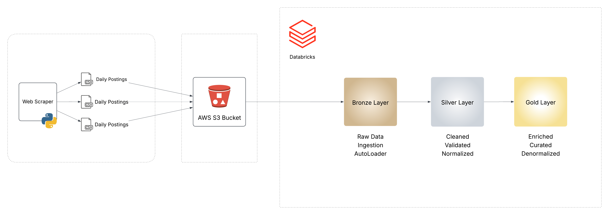
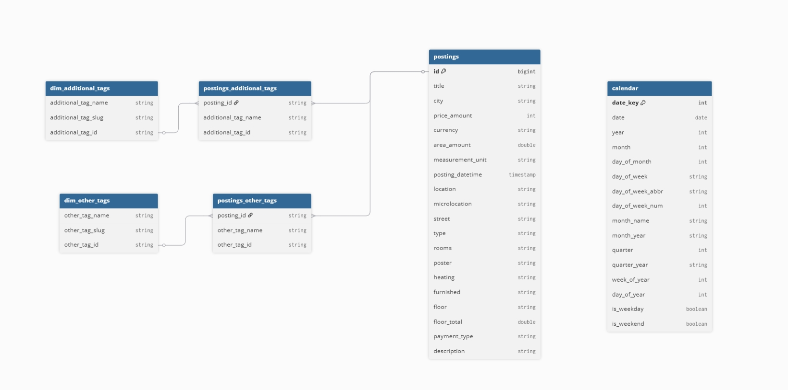
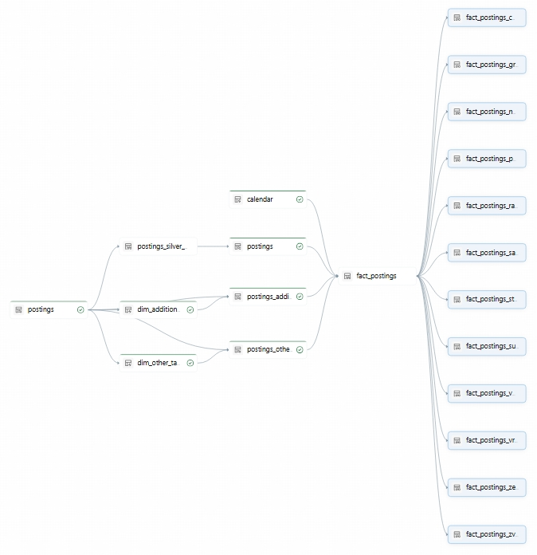

# Spark Declarative Pipelines | Databricks Free Edition | Real Estate Domain

## Introduction

This project is a full end‑to‑end data engineering solution built in the real estate domain, using Python, Spark and Databricks Platform. It features building a Lakeflow Spark Declarative Pipeline inspired by the workflow demonstrated in the [CodeBasics](https://codebasics.io/) tutorial. It showcases how to design a modern data pipeline from raw data collection to analytics‑ready outputs.

The pipeline begins with **web scraping** real estate listings from public property website [Halo Oglasi](https://www.halooglasi.com/nekretnine/izdavanje-stanova/beograd), extracting details such as prices, locations, area, property types, descriptions and other.

The daily scraped data is then uploaded to an **Amazon S3 Bucket**, from where it is ingested into Databricks.

Ingested data is processed in **Databricks** into **bronze**, **silver** and **gold** layers (Medallion Atchitecture) using **Lakeflow Spark Declarative Pipeline** (SDP). 


The project demonstrates core data engineering competencies, including:
- Automated data extraction via web scraping (showcased in [this project](https://github.com/AnaVucic/HaloOglasi-Daily-Scraper))
- Data Ingestion
- ETL pipeline development
- Medallion Architecture
- Declarative Programming Paradigm

By working through a realistic, domain‑specific dataset, this project simulates what real data engineering looks like in an industry setting. It serves as a practical reference for anyone exploring data engineering concepts, portfolio building, or real‑world data workflows.

## Architecture



## Tech Stack

1. Web Scraping - Python, Selenium, Pandas
2. File Format - tab-separated values - .tsv   
3. Cloud Storage - Amazon S3 Bucket
4. Data Platform - Databricks
    - Spark Declarative Pipelines, PySpark
    - AutoLoader
    - Streaming Tables, Views, Materialized Views
    - Change Data Capture
    - Data Modeling Capabilities
    - Python, SQL


## Project Structure & Data Pipeline

The project follows the **Medallion Architecture** (Bronze, Silver, Gold) to ensure data quality and reliability. Below is the breakdown of the transformation logic:

```text
├── transformations/
│   ├── bronze/
│   │   └── postings.py         # Ingests raw S3 data into Bronze using Auto Loader
│   │
│   ├── silver/
│   │   ├── postings.py         # Cleans data, normalizes tags, and handles CDC upserts
│   │   └── calendar.py         # Generates a rich calendar dimension table
│   │
│   └── gold/
│       ├── postings_gold.sql   # Denormalizes Silver tables into a wide analytical table
│       └── locations_gold.sql  # Creates specialized views for Belgrade's key municipalities
```


## Data Model & Pipeline



